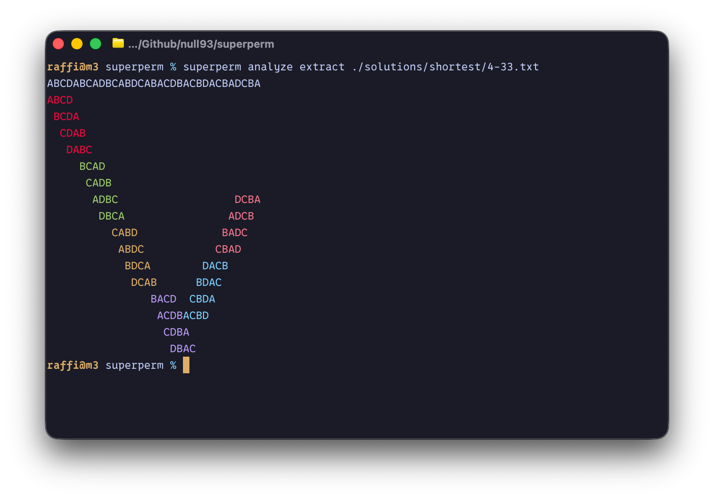

# superperm
> An attempt to find an optimal heuristic solution to the superpermutation problem.




## About

This repo is where I play around with the superpermutation problem, which is still an open problem in math.
It's a mix of my own explorations and other people's algorithms and solutions, implemented here so I can compare them side by side.

The `standard` strategy is the classic recursive construction with length 1! + 2! + ... + n!.
It stops matching the shortest _known_ superpermutation once the alphabet has 6 symbols.

The `egan` strategy is Greg Egan's construction with length n! + (n-1)! + (n-2)! + (n-3)! + n - 3.
It beats `standard` once the alphabet has 7 symbols.

The `pantone` strategy is Jay Pantone's construction from his 43/80 upper bound work, which builds on Egan's.
It uses his computer-found seeds, so it hits his Lean-proved length of 46,181 for 8 symbols.
For 9 symbols it also uses the cut points and join order from rumstd's tweak of Pantone's word, which gets it down to 408,731.
For fewer than 8 symbols it falls back to whichever of `standard` and `egan` is shorter.

The `shortest` column is the shortest length I know of for each alphabet size, collected from other people's work (see the links at the bottom).

## Findings

| **\|alphabet\|** | **\|shortest(alphabet)\|** | **\|standard(alphabet)\|** | **\|egan(alphabet)\|** | **\|pantone(alphabet)\|** |
|:----------------:|:------------------------:|:-----------------------:|:-------------------:|:----------------------:|
| 1 | 1      | 1      | 1      | 1      |
| 2 | 3      | 3      | 3      | 3      |
| 3 | 9      | 9      | 9      | 9      |
| 4 | 33     | 33     | 34     | 33     |
| 5 | 153    | 153    | 154    | 153    |
| 6 | 872    | 873    | 873    | 873    |
| 7 | 5907   | 5913   | 5908   | 5908   |
| 8 | 46181  | 46233  | 46205  | 46181  |
| 9 | 408731 | 409113 | 408966 | 408731 |

## Quick Start

Here's an example of each command along with what it prints.
Color is turned off so the output reads cleanly here.

<details>
<summary>Generate a superpermutation with the egan strategy</summary>

```console
$ superperm generate ABCD -s egan

ABCDACBDCABDCBADCBDACDBACDABCADBCA
```

</details>

<details>
<summary>Generate every variant of a superpermutation that has the same shape</summary>

```console
$ superperm perms ABC | xargs -n1 superperm generate

ABCABACBA
ACBACABCA
BACBABCAB
BCABCBACB
CABCACBAC
CBACBCABC
```

</details>

<details>
<summary>List every permutation of an alphabet</summary>

```console
$ superperm perms ABC

ABC
ACB
BAC
BCA
CAB
CBA
```

</details>

<details>
<summary>Relabel an existing solution into every variant with the same shape</summary>

```console
$ superperm perms ABC | xargs -n1 superperm translate ./solutions/shortest/3-9.txt

ABCABACBA
ACBACABCA
BACBABCAB
BCABCBACB
CABCACBAC
CBACBCABC
```

</details>

<details>
<summary>Check that a solution contains every permutation</summary>

```console
$ superperm verify ./solutions/shortest/3-9.txt

valid superpermutation for n=3 with alphabet ABC and length 9
```

</details>

<details>
<summary>See where each permutation shows up in a solution</summary>

```console
$ superperm analyze extract --no-color ./solutions/shortest/3-9.txt

ABCABACBA
ABC
 BCA
  CAB
    BAC
     ACB
      CBA
```

</details>

<details>
<summary>Count how many permutations each character is part of</summary>

```console
$ superperm analyze heatmap --no-color ./solutions/shortest/3-9.txt

A B C A B A C B A 
1 2 3 2 2 2 3 2 1 
♦ ♦ ♦ ♦ ♦ ♦ ♦ ♦ ♦ 
  ♦ ♦ ♦ ♦ ♦ ♦ ♦   
    ♦       ♦     
```

</details>

<details>
<summary>Rearrange a solution's cycles and watch the layout change</summary>

```console
$ superperm analyze interact ./solutions/shortest/3-9.txt

9
ABCABACBA
ABC
 BCA
  CAB
    BAC
     ACB
      CBA

cycle 1/2 valid | left/right select | up/down move | r/R rotate elements | s/S rotate cycles | q quit
```

</details>

<details>
<summary>Plot each character's position in the alphabet</summary>

```console
$ superperm analyze position --no-color ./solutions/shortest/3-9.txt

A B C A B A C B A 
♦ ♦ ♦ ♦ ♦ ♦ ♦ ♦ ♦ 
  ♦ ♦   ♦   ♦ ♦   
    ♦       ♦     
```

</details>

## Development

Run `make help` for all available commands. In general, you can run `make build-all` to build the binary for all platforms.

## Additional Resources

- https://oeis.org/A180632
- https://en.wikipedia.org/wiki/Superpermutation
- https://github.com/jaypantone/superperm-upper-43-80
- https://github.com/rumstd/superperm-upper-43-80_fork
